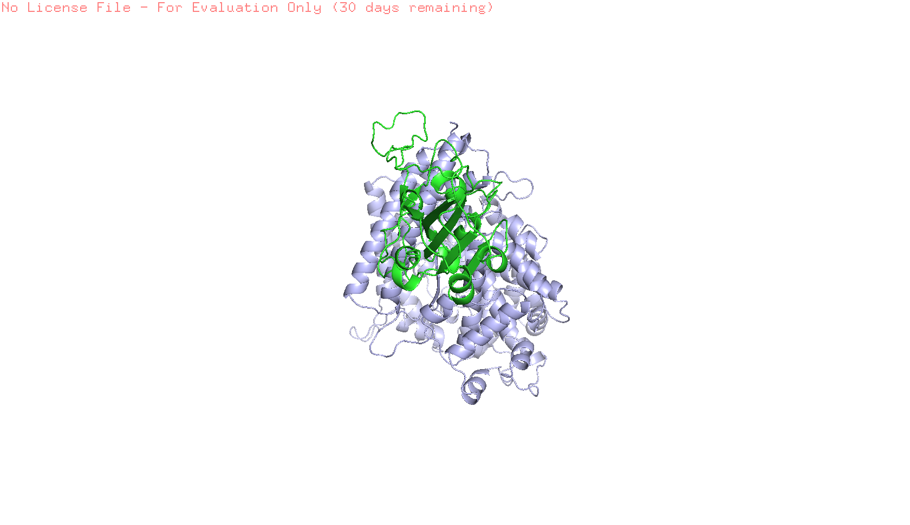

# Modeling SARS-CoV-2 Spike Protein Mutations with MODELLER

This project uses structural homology modeling to generate a 3D model of a 
mutated SARS-CoV-2 spike receptor-binding domain (RBD) in complex with the 
human ACE2 receptor.

## Mutations modeled
- K417N
- E484K
- N501Y

## Project workflow
- Started from a known spike–ACE2 structural template
- Created a PIR alignment file with the mutant target sequence
- Used MODELLER in Python to generate a homology model
- Produced a final modeled structure in PDB format

## Files
- `model.py` — Python script used to run homology modeling
- `data/SARS-CoV-2_spike_ACE2.ali` — alignment file
- `data/SARS-CoV-2_spike_ACE2.pdb` — template structure file
- `SpikeACE2mutant.B99990001.pdb` — final modeled structure

## Results
The modeling run completed successfully and produced a predicted structure 
file:

- `SpikeACE2mutant.B99990001.pdb`

Additional MODELLER output files include restraint, schedule, 
initialization, and violation files.

## Example command
```bash
python model.py data/SARS-CoV-2_spike_ACE2.ali template_6moj 
SpikeACE2mutant data

## Key Result

Successfully generated a 3D structural model of the mutated spike–ACE2 complex using homology modeling.

- Output model: `SpikeACE2mutant.B99990001.pdb`
- Modeling approach: comparative modeling with MODELLER
- Template structure: SARS-CoV-2 spike–ACE2 complex (PDB: 6M0J)

## Structure Visualization (Added structural visualization of spike-ACE2 
model)



The modeled structure shows the SARS-CoV-2 spike receptor-binding domain 
(red) interacting with the human ACE2 receptor (blue).
